# Sistem de monitorizare și irigare a plantelor

## Studenți:
- Luca Monica-Ștefania: monica-stefania.luca@student.tuiasi.ro
- Talmaciu Theodor-Alexandru: theodor-alexandru.talmaciu@student.tuiasi.ro
 
## Cuprins

1. [Descrierea proiectului](#1-descrierea-proiectului)
2. [Cerințe](#2-cerințe)
3. [Arhitectura sistemului – Schemă bloc](#3-arhitectura-sistemului--schemă-bloc)
4. [Componente hardware](#4-componente-hardware)
5. [Schema electrică și alocarea pinilor](#5-schema-electrică-și-alocarea-pinilor)
6. [Arhitectura software](#6-arhitectura-software)
7. [Scenarii de testare](#7-scenarii-de-testare)
8. [Etape de realizare și documentare foto](#8-etape-de-realizare-și-documentare-foto)
9. [Referințe și Bibliografie](#9-referințe-și-bibliografie)


## 1. Descriere proiectului 

Proiectul propune dezvoltarea unui sistem embedded capabil să monitorizeze în timp real nivelul de umiditate din solul unei plante și să intervină automat pentru irigarea acesteia atunci când este necesar.

Sistemul utilizează un microcontroler **Raspberry Pi Pico 2W**, valorificând funcționalitățile acestuia de:
- Conversie analog-digitală (ADC) asistată de acces direct la memorie (DMA)
- Gestionare a evenimentelor asincrone prin întreruperi hardware
- Comunicație prin protocolul I2C cu display-ul LCD
- Conectivitate Wi-Fi cu server HTTP integrat (punct de acces + server web)

Sistemul oferă o **interfață utilizator duală**: un display LCD1602 și un **dashboard web accesibil din browser**, permițând monitorizarea și controlul de la distanță prin Wi-Fi.


## 2. Cerințe

## 2.1 Cerințe funcționale

### Monitorizarea solului
Sistemul citește periodic (la fiecare secundă) valorile analogice de la senzorul capacitiv de umiditate folosind perifericul ADC și tehnologia DMA, calculând media a **10 eșantioane** pentru stabilitate, și convertind valoarea brută într-un procentaj (0–100%).

### Irigare automată
Sistemul acționează modulul releu pentru a porni pompa submersibilă atunci când umiditatea scade sub pragul de **25%**, cu un ciclu temporizat (3s ON / 5s pauză) pentru protecția plantei.

### Afișare locală (LCD)
Pe LCD sunt afișate în timp real:
- Procentul de umiditate și valoarea brută ADC (stare normală)
- Mesaje de alertă cu efect de blink (CRITIC, MANUAL, OPRIT)
- Starea curentă a sistemului

### Interfață web (Wi-Fi)
Pico 2W creează un **punct de acces Wi-Fi** (SSID: `Pico_Irigare`) și rulează un server HTTP la adresa `192.168.4.1`. Dashboard-ul web afișează:
- Umiditatea curentă (actualizat automat la 1 secundă prin `meta refresh`)
- Starea sistemului și uptime-ul dispozitivului
- Butoane pentru pornirea/oprirea manuală a udării

Comunicarea dintre programul intern și pagina web se realizează prin:
- **SSI (Server-Side Includes)** — pentru trimiterea datelor din programul intern spre browser 
- **CGI (Common Gateway Interface)** — pentru primirea comenzilor din browser spre programul intern 

### Acționare manuală și siguranță
Două butoane tactile gestionate prin **întreruperi hardware** (GPIO_IRQ_EDGE_FALL):
- **Buton udare manuală** (GP17) — pornește un ciclu de irigare indiferent de umiditate (dacă Kill Switch este dezactivat)
- **Buton Kill Switch** (GP16) — blochează imediat pompa și dezactivează complet toate sursele de pornire (buton + web), cu comportament de tip întrerupător (o apăsare blochează sistemul, iar o reapăsare îl deblochează)

Ambele butoane au implementat **debouncing software** (250 ms) pentru eliminarea falselor apăsări.

## 2.2 Cerințe non-funcționale:
### Siguranță și izolare electrică
Circuitul logic de control (3.3V) al microcontrolerului nu este conectat direct la elementul de execuție (pompa de 5V), acestea sunt legate prin intermediul unui **modul releu**, pentru a preveni defectarea plăcii de dezvoltare.

### Fiabilitate hardware
Măsurarea umidității solului se va realiza folosind exclusiv un senzor de tip **capacitiv**, evitându-se senzorii rezistivi are se corodează prin electroliză în contact prelungit cu solul umed.

### Protecție la inundație
Odată declanșată pompa (automat sau manual), aceasta va funcționa pentru un timp limitat (3 secunde), urmat de un timp de repaus (5 secunde) în care sistemul nu va mai iriga, chiar dacă pragul este scăzut. Aceasta permite apei să se infiltreze în sol și previne inundarea plantei.

### Reactivitate și Latență
Sistemul trebuie să asigure un timp de răspuns minim la acționarea butonului de oprire de urgență (Kill Switch)

## 3. Arhitectura sistemului – Schemă bloc

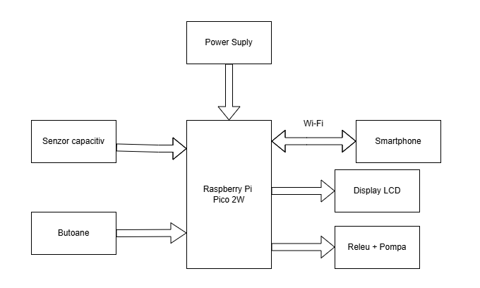

## 4. Componente hardware

| Componentă | Rol 
|---|---|
| **Raspberry Pi Pico 2W** | Microcontroler principal |
| **Senzor capacitiv umiditate** | Măsurare umiditate sol |
| **Display LCD1602 (I2C)** | Afișare locală | 
| **Modul releu 5 V** | Izolare și control pompă | 
| **Pompă submersibilă 5 V** | Irigare | 
| **Butoane tactile (×2)** | Intrare utilizator | 
---

## 5. Schema electrică și alocarea pinilor

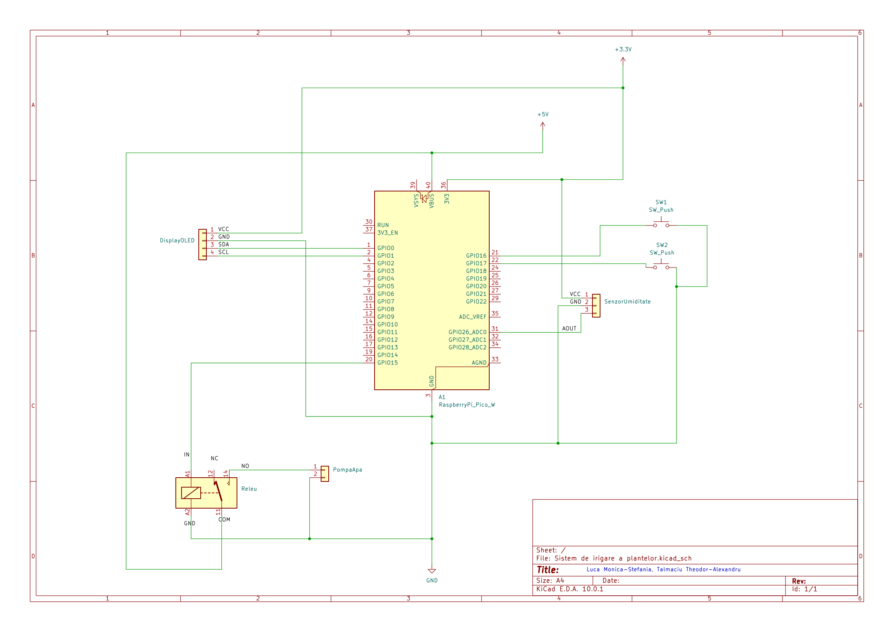

### Alocarea pinilor

| Pin GPIO | Funcție | Componentă |
|---|---|---|
| **GP0** (SDA) | I2C date | LCD1602 |
| **GP1** (SCL) | I2C ceas | LCD1602 |
| **GP15** | Ieșire digitală (releu) | Modul releu → Pompă |
| **GP16** | Intrare digitală (IRQ) | Buton Kill Switch |
| **GP17** | Intrare digitală (IRQ) | Buton udare manuală |
| **GP26** (ADC0) | Intrare analogică | Senzor umiditate |

---

## 6. Arhitectura software

### Structura proiectului

```
MT/
├── README.md
├── docs/
|    ├── doc/                        #resurse referințe
|    ├── images/                     #resurse imagini
|    └── videos/                     #resurse videoclipuri
|                              
└── src/                             # Cod sursă 
    ├── Sistem_de_Udare_a_Plantelor.c   # Bucla principală, mașina de stări
    ├── sensor/
    │   ├── sensor.c                    # Inițializare ADC+DMA, citire și medie
    │   └── sensor.h
    ├── pump/
    │   ├── pump.c                      # Control releu (pornire/oprire pompă)
    │   └── pump.h
    ├── lcd/
    │   ├── lcd.c                       # Driver LCD1602 prin I2C
    │   └── lcd.h
    ├── server/
    │   ├── web_server.c                # Server HTTP (SSI + CGI via lwIP/httpd)
    │   ├── web_server.h
    │   └── lwipopts.h                  # Configurare stivă lwIP
    ├── html_files/
    │   └── index.shtml                 # Dashboard web (SSI tags)
    ├── htmldata.c                      # Fișiere HTML compilate în firmware (makefsdata)
    └── CMakeLists.txt
```
### Schema logică


### Mașina de stări

Logica principală este implementată ca o mașină de stări cu **5 stări de sistem** și **3 stări ale pompei**:


**Stări sistem:**
- `STARE_NORMALA` — umiditate în limitele acceptabile (25%–85%)
- `STARE_PREA_USCAT` — umiditate sub 25%, pornire automată pompă
- `STARE_PREA_UD` — umiditate peste 85%, blocare pompă (risc de înecare)
- `STARE_UDARE_MANUALA` — irigare forțată via buton sau dashboard web
- `STARE_KILL_SWITCH` — blocare completă a pompei, prioritate maximă

**Stări pompă:**
- `POMPA_OPRITA` → `POMPA_PORNITA` (3 secunde) → `POMPA_PAUZA` (5 secunde) → `POMPA_OPRITA`

Ciclul de 3s pornire / 5s pauză previne inundarea solului și permite apei să se infiltreze înainte de o nouă măsurătoare.

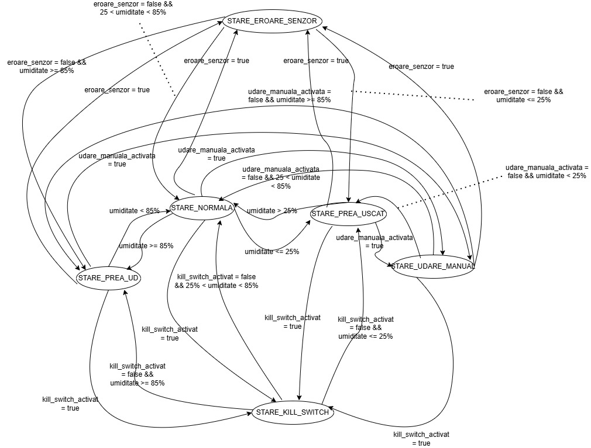


## 7. Scenarii de testare

### 1. Test monitorizare umiditate și irigare automată a solului
**Pași:**
- Se introduce senzorul în sol  
- Se observă valorile afișate pe display  

**Rezultat așteptat:**
- Pe display apare procentul de umiditate al solului (0-100%)  
- Pompa pornește automat dacă valoarea de pe display este sub un anumit prag (ex: 30%)  

### 2. Test acționare manuală a butonului
**Pași:**
- Apasă butonul de irigare  

**Rezultat așteptat:**
- Pompa pornește indiferent de umiditate  

### 3. Test Kill Switch
**Pași:**
- Pornește pompa  
- Apasă butonul de oprire de urgență  

**Rezultat așteptat:**
- Pompa se oprește din irigat  

### 4. Verificarea fiabilității sistemului
**Pași:**
- Lasă sistemul sa ruleze o perioadă îndelungată de timp  

**Rezultat așteptat:**
- Nu apar blocaje  
- Nu se strică vreo componentă a sistemului  

## 8. Etape de realizare și documentare foto

### 1. Analiza valorilor brute și calculul procentajului de umiditate

Am făcut teste pentru a verifica în aer (complet uscat) și în mediul umed (apă) care sunt valorile maxime și minime permise de convertorul analog-digital (ADC) pentru senzorul capacitiv.

* **Testul în aer (Mediu uscat):**
Când senzorul nu detectează deloc apă, valoarea brută este la nivelul maxim, de aproximativ 2770.

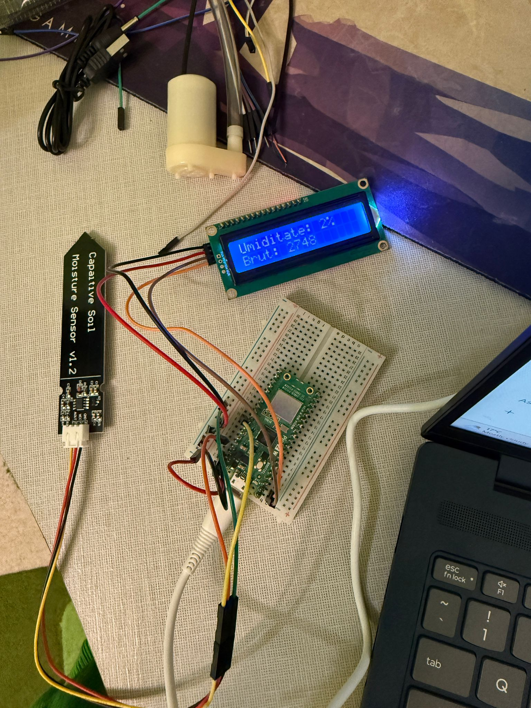

* **Testul în apă (Mediu complet umed):** La scufundarea senzorului în apă, valoarea brută scade semnificativ, la aproximativ 1100.

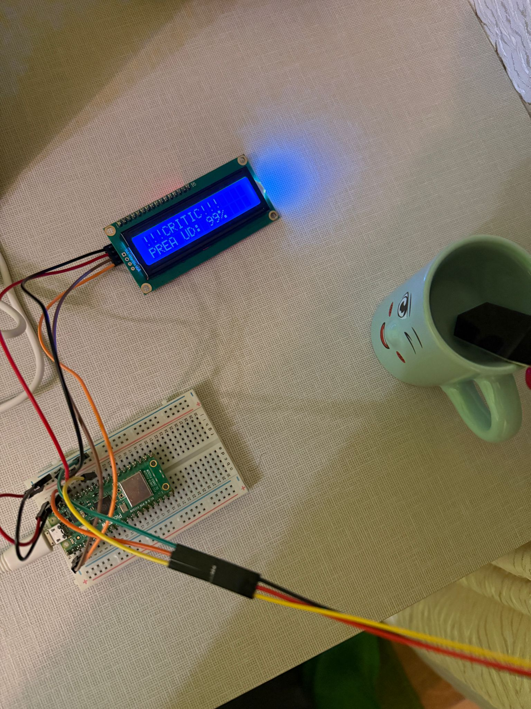

**Modelul Matematic:**
Pentru a transpune valorile brute în procente (0% ... 100%), am aplicat ecuația:

$$Umiditate (\%) = \left( \frac{Val_{Uscat} - Val_{Citită}}{Val_{Uscat} - Val_{Apă}} \right) \times 100$$

Unde $Val_{Uscat}$ este pragul maxim calibrat în aer (2770), iar $Val_{Apă}$ este pragul minim obținut la scufundarea completă a senzorului în apă (1100).

*Notă: În această etapă a fost adăugat și mesajul de alertă **!!!CRITIC!!!** pe display. Acesta apare atunci când procentajul scade sub 25% (sol prea uscat) sau crește peste 85% (risc de înecare a rădăcinilor).*

### 2. Testare în mediu real
Testul a reprezentat succesul fazei de calibrare hardware. Am introdus senzorul în solul plantei pentru a verifica comportamentul sistemului.

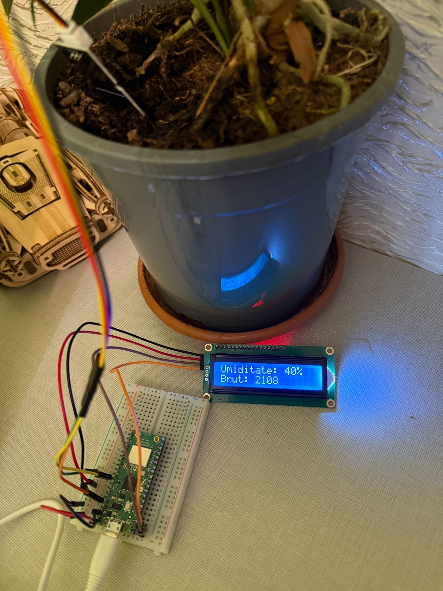

**Rezultat:** Sistemul a preluat valoarea brută atenuată de sol și a calculat corect un procent intermediar stabil (ex: 40%), confirmând acuratețea calibrării.

### 3. Integrarea și Testarea Butoanelor
Pentru ca sistemul să aibă un timp de reacție cât mai mic, au fost integrate două butoane tactile pe breadboard, gestionate exclusiv prin întreruperi și funcții de debouncing software.

**Testarea funcției "Kill Switch" (Oprire de urgență):**
În imaginea de mai jos, se observă activarea stării de urgență. La apăsarea primului buton, microcontrolerul întrerupe instantaneu orice proces, taie alimentarea pompei (prin modulul releu) și afișează pe ecranul LCD mesajul de alertă `!!!OPRIT!!! KILL SWITCH ON`. Sistemul rămâne blocat în această stare de siguranță până la o nouă acționare a butonului.

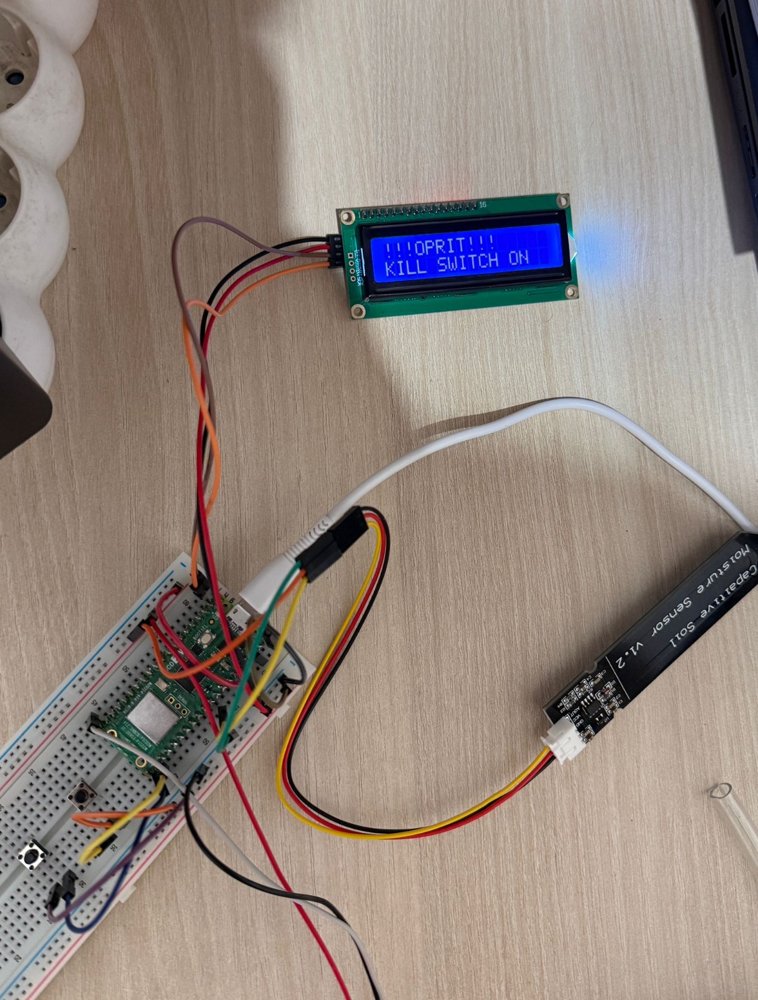

**Testarea funcției de "Udare Manuală":**
Al doilea buton permite utilizatorului să ignore temporar citirile senzorului și să forțeze pornirea pompei. Odată apăsat, sistemul intră în ciclul de irigare manuală, confirmând acțiunea prin mesajul `!!!MANUAL!!! UDARE ACTIVATA` afișat pe display-ul I2C.

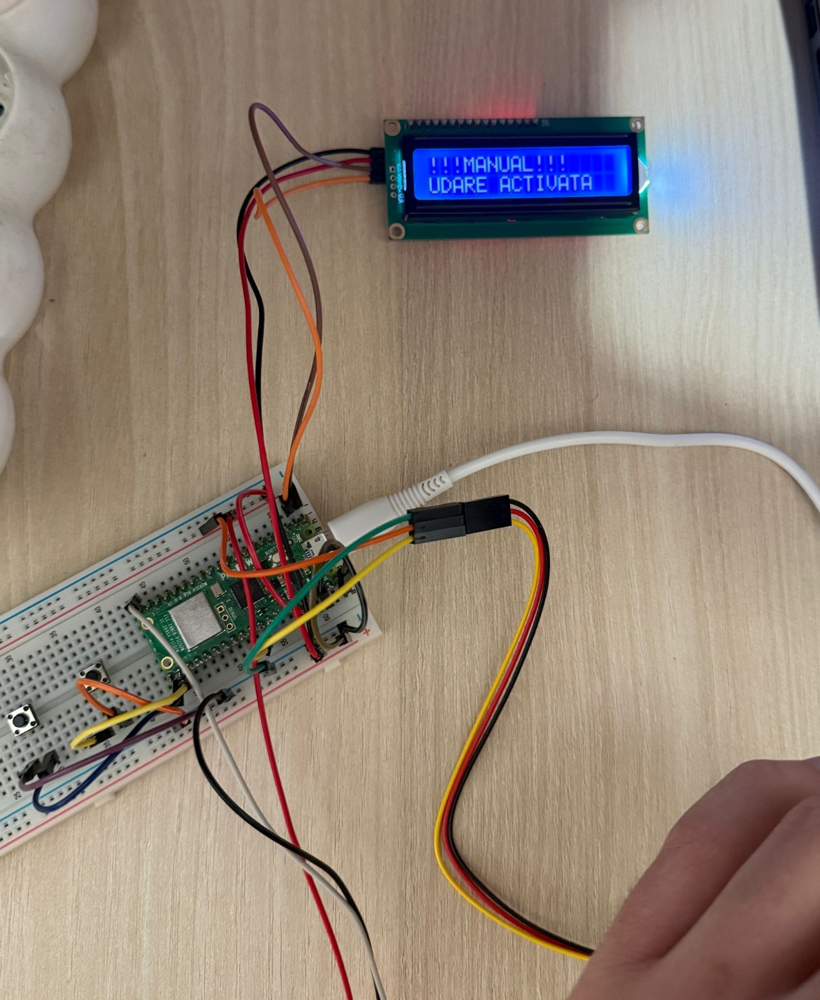

### 4. Conectarea la Dashboard-ul Web (Sincronizarea prin Wi-Fi)
Am setat plăcuța Pico 2W să își facă propria rețea Wi-Fi (numită `Pico_Irigare`). Când ne conectăm la ea cu laptopul, putem vedea un site care se actualizează singur la fiecare secundă.

* **Sincronizarea în timp real (Stare normală - 28%):**
Aici se vede tot montajul în acțiune (senzorul în sol și pompa în borcanul cu apă). Se observă cum și display-ul LCD și site-ul arată exact aceeași valoare: **28%**.
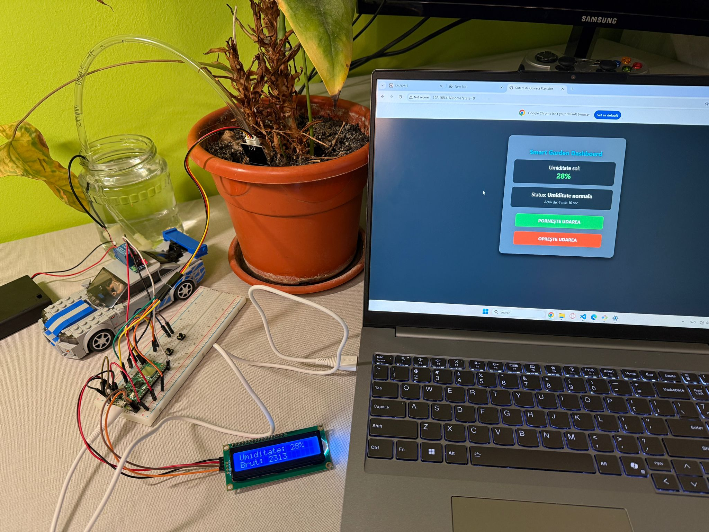

* **Cum arată dashboard-ul când solul este uscat (2%):**
Se poate observa că site-ul ne permite să pornim udarea plantei prin butonul de **"PORNEȘTE UDAREA"**, iar starea sistemului intră în starea de **"STARE_UDARE_MANUALA"**. Putem ieși din această stare cu ajutorul butonului **"OPREȘTE UDAREA"**.
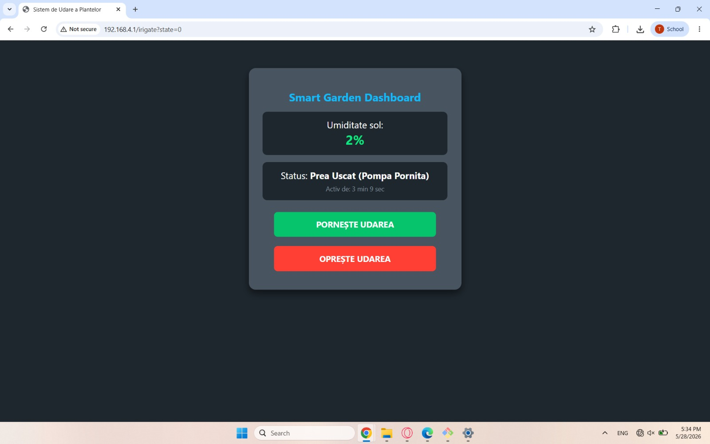

### 5. Testarea Sistemelor de Siguranță pe Site
Am vrut să fim siguri că site-ul web ne protejează planta și nu ne lasă să facem o udăm din browser dacă sistemul e blocat sau dacă solul e deja plin de apă.

* **Site-ul blocat de la butonul de urgență:**
În momentul în care apăsăm butonul fizic de Kill Switch de pe placă, butoanele devin inactive și scrie mare **SISTEM BLOCAT**. Nimeni nu mai poate porni pompa din browser până nu deblocăm butonul.


* **Site-ul blocat când pământul este prea ud (96%):**
Dacă pământul este deja inundat cu apă, butoanele de pe site se transformă în **PORNIRE BLOCATĂ**, iar programul de pe plăcuță va refuza orice comandă, ca să nu înecăm planta.
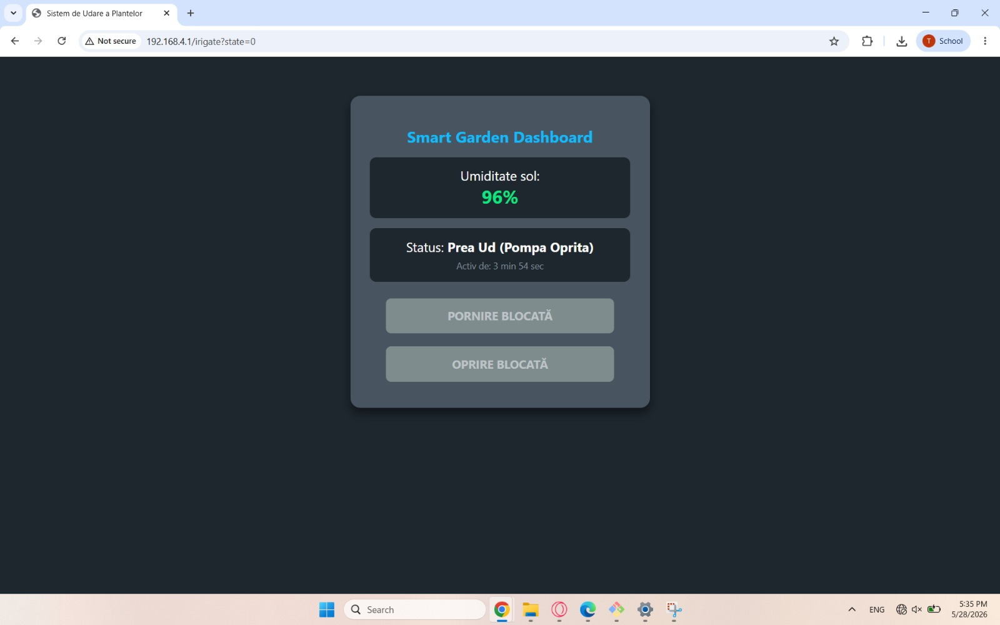

### 6. Clipurile video cu proiectul în acțiune
Pentru a arăta exact cum funcționează totul în timp real, am filmat două scenarii importante:

* **Video 1: Pornirea pompei direct din browser**
În acest clip se vede cum dăm click pe butonul verde de pe laptop, releul face „click” pe masă, pompa începe să bage apă în ghiveci, iar procentul de umiditate începe să crească live pe ecran.
[Urmărește Video - Control Web și Irigare Dinamică](docs/videos/video-control-web.mp4)

* **Video 2: Testul opririi de urgență**
Atunci când apăsăm butonul fizic de Kill Switch, pompa se oprește instant, iar butoanele devin imediat gri și blocate.
[Urmărește Video - Testare Kill Switch și Sincronizare](docs/videos/video-killswitch.mp4)

## 9. Referințe și Bibliografie

Pe parcursul dezvoltării acestui proiect, implementarea hardware și software a fost realizată consultând următoarele documentații și resurse oficiale:

1. **Documentație Microcontroler (Raspberry Pi):**
   * [Raspberry Pi Pico Examples (GitHub)](https://github.com/raspberrypi/pico-examples) - — Repository-ul oficial cu exemple de cod, folosit extensiv ca resursă principală pentru implementarea perifericelor hardware (comunicare I2C, convertor ADC, DMA, întreruperi).    
   * [Raspberry Pi Pico C/C++ SDK](docs/doc/raspberry-pi-pico-c-sdk.pdf) - Manualul oficial pentru scrierea codului în C, configurarea convertorului ADC, utilizarea memoriei prin DMA și setarea întreruperilor hardware (IRQ).
   * [Raspberry Pi Pico W Datasheet](docs/doc/pico-2-w-datasheet.pdf) - Utilizat pentru arhitectura hardware și identificarea pinilor.
2. **Datasheet-uri Componente Hardware:**
    * [LCD1602 Display Datasheet](docs/doc/lcd-datasheet.pdf) - Setul de instrucțiuni hardware pentru afișajul pe display.
    * [I2C Datasheet](docs/doc/i2c-datasheet.pdf) - Datasheet-ul protocolului I2C
3. **Rețea și Web Server**
    * [Pico W Webserver Template (LearnEmbeddedSystems)](https://github.com/LearnEmbeddedSystems/pico-w-webserver-template) - Repository GitHub folosit ca punct de plecare și referință arhitecturală pentru implementarea serverului web.